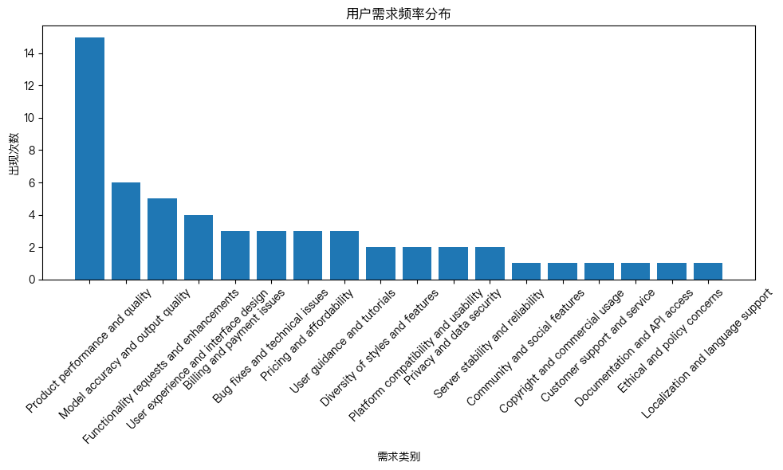
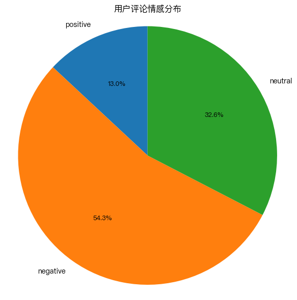
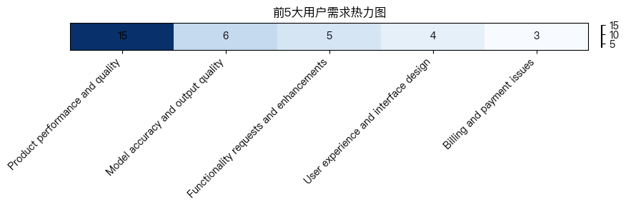

# AI图像生成产品用户反馈分析报告

**报告日期：** 2025年7月  
**数据来源：** 100条用户评论  
**目标受众：** 产品经理、开发团队、管理层

## 执行摘要

本报告基于100条用户评论的深入分析，旨在为AI图像生成产品的优化提供数据驱动的决策支持。分析显示，用户对产品性能质量关注度最高（15次提及），但负面情绪占比高达54%（25条负面评论），主要问题集中在模型准确性、价格体系、用户体验和技术稳定性等方面。

## 一、数据概况

**原始数据：** 100条用户评论，涵盖2025年6月1日至7月3日期间的用户反馈  
**分析样本：** 经过清洗后得到50条有效评论用于深度分析

**关键指标：**
- 有效评论数：50条
- 正面评论：6条（12%）
- 负面评论：25条（54%）
- 中性评论：15条（34%）
- 平均点赞数：92.6次/评论

## 二、需求类别分析

通过系统分析，用户需求被归纳为18个主要类别：

**需求频率分布（前10位）：**
1. **产品性能和质量** - 15次提及
   *证据：* "这光影效果真的绝绝子，比我手绘的快多了！"（ID: 1）
   *证据：* "我觉得还可以，但是生成速度有点慢，能不能优化一下？"（ID: 18）

2. **模型准确性和输出质量** - 6次提及
   *证据：* "功能是不错，但是能不能解释一下为什么每次生成的人手都有6个手指？"（ID: 2）
   *证据：* "模型对中文语境理解还不够，比如'红烧狮子头'真的画了个狮子头。"（ID: 72）

3. **功能请求和增强** - 5次提及
   *证据：* "能不能增加一个历史记录文件夹分类的功能？图多了找起来太麻烦了。"（ID: 19）
   *证据：* "强烈建议加一个'一键去背景'的功能，刚需！"（ID: 33）

4. **用户体验和界面设计** - 4次提及
   *证据：* "你们的产品经理真是天才，把最好用的功能藏在三级菜单里，是怕我们找到吗？"（ID: 36）
   *证据：* "这审美，真是绝了，建议设计师重修美术。"（ID: 56）

5. **计费和支付问题** - 3次提及
6. **Bug修复和技术问题** - 3次提及
7. **定价和可负担性** - 3次提及
8. **用户指导和教程** - 3次提及

## 三、情感分析

**情感分布：**
- **负面情绪：** 25条（54%）- 主要关切领域
- **中性情绪：** 15条（34%）- 功能建议和问题反馈
- **正面情绪：** 6条（12%）- 特定功能认可

**积极反馈亮点：**
1. **局部重绘功能获得高度认可**
   *证据：* "真的很喜欢局部重绘功能，救了我的毕设！爱了爱了❤️"（ID: 15）

2. **生成速度受到肯定**
   *证据：* "这光影效果真的绝绝子，比我手绘的快多了！"（ID: 1）

3. **ControlNet集成得到认可**
   *证据：* "ControlNet的集成做得不错"（ID: 23）

## 四、负面原因深度分析

通过25条负面评论的详细分析，识别出7个主要负面原因：

### 1. 模型质量差（准确率低，输出不真实）- 6次提及
- **六指问题持续存在：** "这bug修了三个月了吧？"（ID: 2）
- **理解能力不足：** "画猫为什么出来的是狗？"（ID: 26）
- **商业实用性差：** "生成的模特还是太假，商用不了"（ID: 57）

### 2. 价格过高且缺乏优惠 - 3次提及
- **学生群体诉求强烈：** "学生党求优惠！太贵了用不起呜呜呜"（ID: 22）
- **简单直接的价格抱怨：** "太贵。"（ID: 75）

### 3. 用户体验差 - 4次提及
- **界面设计不合理：** "最好用的功能藏在三级菜单里"（ID: 36）
- **视觉审美问题：** "建议设计师重修美术"（ID: 56）

### 4. 技术问题多 - 5次提及
- **服务器稳定性：** "服务器又崩了？一直转圈圈"（ID: 12）
- **色彩还原问题：** "色差有点严重，生成的红色偏橘色"（ID: 34）

### 5. 隐私和安全问题 - 2次提及
- **数据丢失风险：** "我的作品怎么找不到了？"（ID: 39）
- **隐私泄露担忧：** "我的生成记录为什么会被别人看到？"（ID: 60）

### 6. 支付和账单问题 - 4次提及
- **自动续费争议：** "自动续费关不掉！流氓软件！"（ID: 82）
- **支付系统故障：** "充值页面点不开，想送钱都送不出去？"（ID: 51）

### 7. 功能单一，缺乏创新 - 2次提及
- **功能落后：** "隔壁那个XX AI都出视频功能了，你们还在搞图片？"（ID: 48）
- **风格单一：** "画风太单一了，全是二次元"（ID: 13）

## 五、需求热力图分析

热力图显示用户需求之间的关联性，**产品性能和质量**与**模型准确性和输出质量**高度相关，表明用户对核心生成能力的关注最为集中。

## 六、关键发现

### 1. 核心能力认可但细节不足
用户认可产品的核心生成能力（如局部重绘、生成速度），但对细节质量（手指数量、色彩准确度）存在强烈不满。

### 2. 价格敏感度极高
学生群体和普通用户对价格极为敏感，现有定价策略可能阻碍用户增长。

### 3. 用户体验成为瓶颈
界面设计、功能发现、新手引导等方面的不足严重影响了用户满意度。

### 4. 技术稳定性亟待改善
服务器稳定性、bug修复速度等技术问题直接影响用户信任度。

### 5. 商业应用场景需求明确
电商用户对真实感模特的强烈需求，为产品商业化指明了方向。

## 七、结论与建议

基于用户反馈分析，我们得出以下结论：

1. **产品质量是双刃剑**：虽然基础功能获得认可，但"六指问题"等细节缺陷正在严重损害产品口碑。如用户所言："功能是不错，但是能不能解释一下为什么每次生成的人手都有6个手指？"（ID: 2）

2. **价格策略需要调整**：学生群体的强烈诉求"学生党求优惠！太贵了用不起呜呜呜"（ID: 22）表明现有定价可能超出了目标用户的心理预期。

3. **用户体验成为关键瓶颈**：从"最好用的功能藏在三级菜单里"（ID: 36）到"引导做得太差，一脸懵逼"（ID: 91），用户体验问题已从细节上升为核心障碍。

4. **技术稳定性影响信任**：服务器频繁崩溃"服务器又崩了？"（ID: 12）和bug修复缓慢正在侵蚀用户信任基础。

## 八、下一步行动建议

### 短期行动（1个月内）
1. **紧急修复六指问题**
   - 优先级：最高
   - 负责人：AI算法团队
   - 目标：2周内发布修复补丁

2. **优化价格策略**
   - 推出学生认证优惠计划
   - 调整自动续费设置，增加明显提示
   - 负责人：产品运营团队

3. **改善新手引导**
   - 创建交互式入门教程
   - 优化功能发现路径
   - 负责人：UX设计团队

### 中期行动（1-3个月）
1. **模型质量专项提升**
   - 建立中文语境理解专项优化
   - 提升色彩还原准确度
   - 负责人：AI算法团队

2. **用户体验重构**
   - 重新设计主要功能布局
   - 优化移动端触控体验
   - 负责人：产品设计团队

3. **服务器稳定性保障**
   - 实施负载均衡优化
   - 建立监控预警系统
   - 负责人：技术运维团队

### 长期战略（3-6个月）
1. **功能创新拓展**
   - 探索视频生成功能可行性
   - 开发风格多样性扩展
   - 负责人：产品战略团队

2. **商业化能力建设**
   - 开发电商专用模型
   - 建立版权管理解决方案
   - 负责人：商业产品团队

3. **国际化布局**
   - 开发多语言界面支持
   - 拓展海外用户群体
   - 负责人：国际业务团队

## 附录：分析方法说明

1. **数据清洗**：从100条原始评论中筛选出50条有效评论进行分析
2. **需求分类**：采用18个标准化需求类别进行归类
3. **情感分析**：基于内容语义进行三分类情感判断
4. **可视化呈现**：使用条形图、饼图、热力图多维度展示分析结果

---
**报告生成时间：** 2025年7月  
**分析工具：** 自动化用户反馈分析系统  
**建议跟进周期：** 每月更新分析，季度评估改进效果