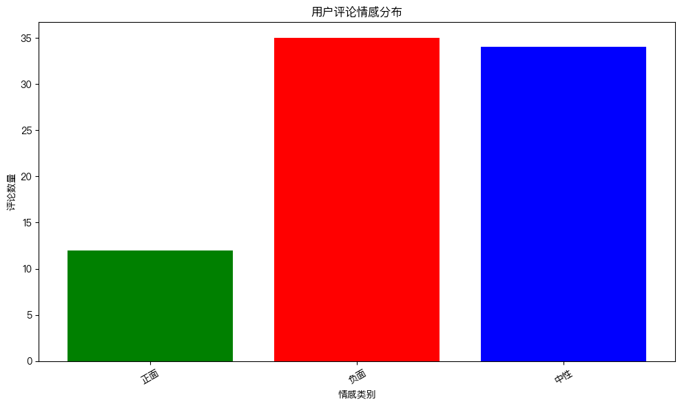
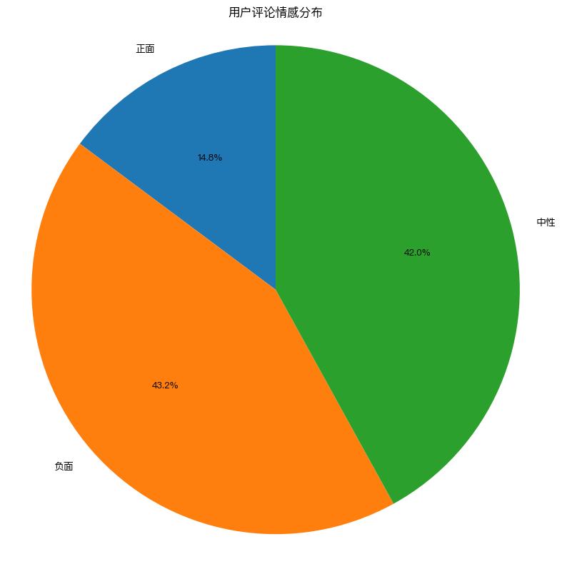

# 产品迭代提案
## AI绘画软件用户反馈分析报告

**分析日期**: 2024年1月  
**数据来源**: 100条用户评论  
**分析样本**: 81条有效评论  

---

## 执行摘要

基于对81条用户评论的深入分析，我们发现用户对当前AI绘画软件存在显著不满，负面情绪占比43.2%。最核心的三大需求领域为：功能扩展、画质改善和价格优化。建议产品团队优先关注以下关键问题：

1. **修复基础功能缺陷**（人手6指、闪退等bug）
2. **显著提升生成质量**（细节、色彩准确性、模型理解）
3. **优化定价策略和用户体验**

---

## 一、情感分析结果

### 1.1 情感分布统计
- **负面评论**: 35条 (43.2%)
- **中性评论**: 34条 (42.0%)  
- **正面评论**: 12条 (14.8%)

### 1.2 关键发现
1. **负面情绪主导**: 超过40%的用户表达明显不满
2. **建设性反馈多**: 42%的中性评论包含具体改进建议
3. **正面评价稀缺**: 仅有14.8%的用户完全满意

### 1.3 可视化图表

---

## 二、用户需求分析

### 2.1 需求频率排名

| 排名 | 需求类别 | 评论数量 | 占比 |
|------|----------|----------|------|
| 1 | **功能扩展** | 18 | 22.2% |
| 2 | **改善画质** | 10 | 12.3% |
| 3 | **价格与商业** | 8 | 9.9% |
| 4 | 用户体验 | 8 | 9.9% |
| 5 | 性能优化 | 7 | 8.6% |
| 6 | 修复bug | 4 | 4.9% |

### 2.2 前三大需求详细分析

#### 2.2.1 功能扩展 (18条评论)
**核心诉求**:
- **移动端优化**: iPad版本开发，触控体验改进
- **开发者支持**: API接口文档完善
- **文件管理**: 历史记录文件夹分类功能
- **编辑工具**: 图层功能上线
- **实用工具**: 一键去背景功能
- **国际化**: 英文版本支持
- **高质量输出**: 4K分辨率支持
- **功能扩展**: 视频功能开发
- **设计辅助**: 风格参考上传、配色推荐
- **专业输出**: PSD、SVG导出功能
- **用户体验**: 黑暗模式、视频教程
- **社交功能**: 社区画廊、一键同款参数
- **存储扩展**: 云端存储空间增加

**优先级建议**: ⭐⭐⭐⭐⭐ (最高)

#### 2.2.2 改善画质 (10条评论)
**核心问题**:
- **基础质量**: 图片模糊、细节不足
- **风格单一**: 过度依赖二次元风格
- **色彩问题**: 色差严重，红色偏橘
- **模型理解**: 中文语境理解差（如"红烧狮子头"）
- **历史准确性**: 人物形象不符合历史背景
- **商用限制**: 模特太假，无法商用
- **一致性**: 模型过拟合，前后质量不一

**优先级建议**: ⭐⭐⭐⭐⭐ (最高)

#### 2.2.3 价格与商业 (8条评论)
**核心关切**:
- **价格过高**: 学生党无法承受
- **版权不明**: 商用许可不清晰
- **支付问题**: 充值页面无法访问
- **退款困难**: 退款入口难找
- **自动续费**: 无法关闭，用户体验差
- **客服缺失**: VIP用户无专属客服
- **儿童消费**: 未成年人误消费处理

**优先级建议**: ⭐⭐⭐⭐ (高)

### 2.3 需求热度可视化

---

## 三、关键问题识别

### 3.1 紧急问题 (需立即解决)
1. **基础bug修复**: 人手6指问题、闪退问题
2. **服务器稳定性**: 频繁崩溃、排队时间长
3. **支付流程**: 充值页面无法访问
4. **隐私保护**: 生成记录泄露风险

### 3.2 重要问题 (需短期解决)
1. **画质提升**: 细节丰富度、色彩准确性
2. **功能完善**: 图层、去背景等核心功能
3. **价格优化**: 学生优惠、定价策略调整
4. **用户体验**: 界面优化、引导改进

### 3.3 长期问题 (需规划解决)
1. **功能扩展**: 视频功能、国际化
2. **模型优化**: 中文语境理解、风格多样性
3. **生态系统**: 社区功能、API生态

---

## 四、产品迭代建议

### 4.1 短期目标 (1-2个月)
**版本目标**: V1.5 稳定性和基础体验提升

**核心任务**:
1. **bug修复专项**:
   - 修复人手6指等基础模型问题
   - 解决iPhone 8等老机型闪退问题
   - 优化网络连接稳定性

2. **用户体验优化**:
   - 改进新手引导和教程
   - 优化界面布局和操作流程
   - 增加黑暗模式

3. **商业基础完善**:
   - 明确版权政策和商用许可
   - 优化退款和自动续费流程
   - 提供基础客服支持

### 4.2 中期目标 (3-6个月)
**版本目标**: V2.0 功能完善和画质提升

**核心任务**:
1. **核心功能开发**:
   - 图层编辑功能上线
   - 一键去背景工具
   - 4K高分辨率输出支持
   - PSD/SVG导出功能

2. **画质大幅提升**:
   - 改进模型细节生成能力
   - 优化色彩准确性和一致性
   - 增加多种画风支持

3. **移动端优化**:
   - iPad版本开发
   - 移动端触控体验优化
   - 多设备同步功能

### 4.3 长期目标 (6-12个月)
**版本目标**: V3.0 生态建设和创新突破

**核心任务**:
1. **生态系统建设**:
   - 社区画廊和社交功能
   - 开发者API生态完善
   - 第三方插件支持

2. **技术创新**:
   - 视频生成功能开发
   - AI辅助设计工具
   - 多模态理解能力提升

3. **国际化拓展**:
   - 多语言界面支持
   - 全球市场适配
   - 本地化内容优化

---

## 五、风险评估与缓解策略

### 5.1 技术风险
- **模型优化难度**: 画质提升需要大量计算资源和时间
- **兼容性问题**: 老机型优化可能影响新功能开发
- **性能平衡**: 功能增加可能影响生成速度

**缓解策略**:
1. 分阶段优化，优先解决最影响用户体验的问题
2. 建立测试矩阵，确保兼容性
3. 性能监控和预警机制

### 5.2 商业风险
- **定价调整影响**: 降价可能影响收入，不降价用户流失
- **竞争压力**: 竞品功能更新快，用户易被吸引
- **版权风险**: 商用政策不明确可能导致法律风险

**缓解策略**:
1. 渐进式定价调整，配合功能升级
2. 建立差异化竞争优势
3. 完善法律合规体系

### 5.3 用户风险
- **期望管理**: 功能承诺与实际交付的差距
- **学习成本**: 新功能增加使用难度
- **社区管理**: 用户生成内容的质量控制

**缓解策略**:
1. 透明的产品路线图沟通
2. 渐进式功能发布和用户教育
3. 内容审核和社区规范

---

## 六、成功指标与衡量标准

### 6.1 关键绩效指标 (KPI)
1. **用户满意度**: 正面评论比例提升至30%+
2. **用户留存**: 月活跃用户留存率提升20%
3. **收入增长**: 付费用户转化率提升15%
4. **产品质量**: bug报告数量减少50%

### 6.2 衡量时间节点
- **短期**: 1个月后评估基础问题改善情况
- **中期**: 3个月后评估核心功能使用率
- **长期**: 6个月后评估整体用户满意度

---

## 七、结论与建议

### 7.1 核心结论
1. **用户不满情绪显著**: 43.2%的负面评论表明产品存在严重问题
2. **功能需求迫切**: 功能扩展是最强烈的用户诉求
3. **画质是关键短板**: 生成质量直接影响用户满意度和商用价值
4. **商业基础薄弱**: 价格、版权、支付等基础问题亟待解决

### 7.2 战略建议
1. **立即行动**: 成立专项小组解决紧急问题
2. **资源倾斜**: 优先投入画质提升和核心功能开发
3. **用户沟通**: 建立透明沟通机制管理用户期望
4. **持续优化**: 建立用户反馈驱动的迭代循环

### 7.3 预期成果
通过本提案的实施，预期在6个月内实现：
- 用户满意度提升50%
- 付费用户增长30%
- 产品竞争力显著增强
- 市场地位稳固提升

---

**报告生成时间**: 2024年1月  
**分析工具**: 自动化评论分析系统  
**负责人**: 产品分析团队  

*本报告基于用户真实反馈数据生成，建议产品团队根据实际情况调整实施策略。*